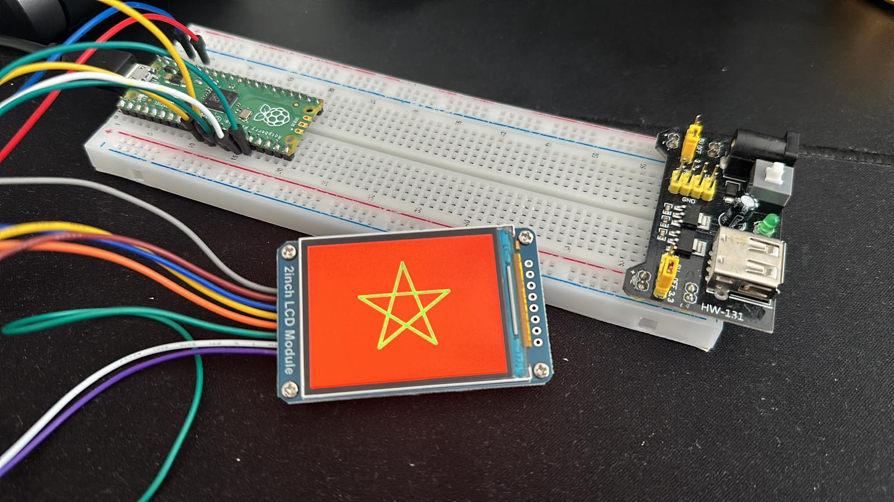

# LCD ST7789 Library for Raspberry Pi Pico

This library provides a set of functions to control an ST7789-based LCD display using the Raspberry Pi Pico. It allows for easy drawing of basic shapes, text rendering, and color manipulation.




## Features

- Initialize and configure the ST7789 LCD
- Draw basic shapes: pixels, lines, rectangles, circles
- Render text using a 5x7 pixel font
- Fill screen with solid colors
- 16-bit color support (RGB565)

## Hardware Requirements

- Raspberry Pi Pico
- ST7789-based LCD display
- Appropriate connections between the Pico and the LCD

## Pin Connections

| Raspberry Pi Pico | ST7789 LCD |
|-------------------|------------|
| GPIO 13           | BL (Backlight) |
| GPIO 8            | DC (Data/Command) |
| GPIO 12           | RST (Reset) |
| GPIO 11           | MOSI |
| GPIO 10           | SCK |
| GPIO 9            | CS |

## Installation

1. Clone this repository into your Raspberry Pi Pico project directory:

   ```
   git clone https://github.com/yourusername/lcd-st7789-library.git
   ```

2. Include the library headers in your project:

   ```c
   #include "lcd_st7789_library.h"
   ```

3. Make sure to link against the library when compiling your project.

## Usage

Here's a basic example of how to use the library:

```c
#include "pico/stdlib.h"
#include "lcd_st7789_library.h"

int main() {
    // Initialize the LCD
    lcd_init();

    // Fill the screen with blue
    lcd_fill_color(create_color(0, 0, 255));

    // Draw a white rectangle
    lcd_draw_rect(10, 10, 100, 50, create_color(255, 255, 255));

    // Draw some text
    lcd_draw_text(20, 20, "Hello, World!", create_color(255, 0, 0), create_color(0, 0, 255), 2);

    while(1) {
        // Your main loop
    }

    return 0;
}
```

## API Reference

See `lcd_st7789_library.h` for a complete list of available functions and their descriptions.

## Contributing

Contributions to improve the library are welcome. Please feel free to submit a Pull Request.

## License

[MIT License](LICENSE)

## Acknowledgments

- This library was developed for use with the Raspberry Pi Pico.
- Thanks to the Raspberry Pi Foundation for their excellent SDK and documentation.

